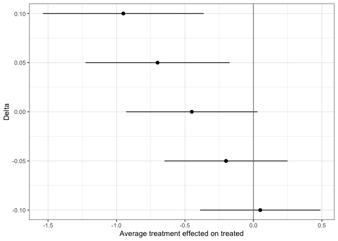
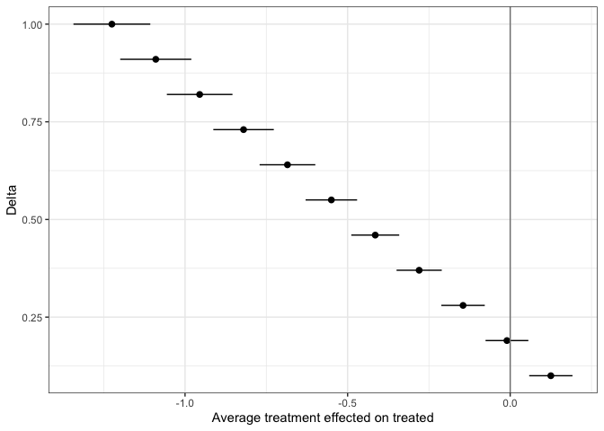

<!-- README.md is generated from README.Rmd. Please edit that file -->

# scqe

<!-- badges: start -->

<!-- badges: end -->

The scqe package allows users to implement the stability controlled
quasi-experiment (SCQE) (Hazlett, 2019) approach to study the effects of
newly adopted treatments that were not assigned at random. This package
contains tools to help users avoid making statistical assumptions that
rely on infeasible assumptions. The scqe function allows user to study
both the 1 cohort and 2 cohort cases.

## Motivation

Typical covariate-adjustment techniques used in statistical analysis
impose the often too strict “no-unobserved confounding” assumption.
Ignoring relevant cofounding biases can lead to overconfidence or
inaccuracy of experimental results. SCQE instead imposes an assumption
about the “baseline trend” for the change in average non-treatment
outcome between successive cohorts in observational studies. More
information about this method can be found in Hazlett, 2019.

## Installation

You can install the development version of scqe from
[GitHub](https://github.com/) with:

``` r
# install.packages("devtools")
devtools::install_github("chadhazlett/scqe")
```

## Example

The following examples will demonstrate how to use the scqe function for
both the 1 and 2 cohort case when users wish to input either full data
or summary statistics alone.

Simulated data:

``` r
set.seed(1234)
post = c(rep(0,100), rep(1,100))
tx = c(rep(0, 100), rbinom(n = 100, prob=.27, size=1))
y = rbinom(n=200, prob = .1 + .02*post - .05*tx, size=1)
```

Example 1: 2 cohorts, full data

``` r
library(scqe)
scqe.2cohort.full = scqe(post=post, treatment=tx, outcome=y, delta=seq(from=-.1, to=.1, by=0.05))
scqe.2cohort.full$result
#>    term estimate   conf.low  conf.high
#> 1 -0.10     0.05 -0.3897057  0.4897057
#> 2 -0.05    -0.20 -0.6495242  0.2495242
#> 3  0.00    -0.45 -0.9297968  0.0297968
#> 4  0.05    -0.70 -1.2270104 -0.1729896
#> 5  0.10    -0.95 -1.5370919 -0.3629081
```

The results can be plotted by calling plot() on an scqe object.

``` r
plot(scqe.2cohort.full)
```



The results can be summarized by calling summary() on an scqe object.

``` r
summary(scqe.2cohort.full)
#> To claim the treatment made the outcome significantly less likely,
#>  one must claim the shift in outcomes under no treatment change was 0.007
#>  To claim the treatment made the outcome significantly more likely,
#>  one must claim the shift in outcomes under no treatment change was -0.184
#>  To claim the treatment had exactly 0 effect on the outcome,
#>  one must claim the shift in outcomes under no treatment change was exactly -0.09
```

Example 2: 2 cohorts, summary statistics The user can input summary
statistics about the data instead of the full data (as in the previous
example). Plot and summary methods can be used here as
well.

``` r
scqe.2cohort.sum = scqe(untr_pre=200,untr_post=150,tr_post=50,tr_pre=0,Y_tr_post=20,Y_untr_post=1,Y_tr_pre=0, Y_untr_pre=5,min_delta=.1, max_delta=1)
scqe.2cohort.sum$result
#>    assumed_pre2post_shift SCQE_estimate SCQE_stderr term estimate
#> 1                    1.00         -3.68   0.5072618 1.00    -3.68
#> 2                    0.91         -3.32   0.4637405 0.91    -3.32
#> 3                    0.82         -2.96   0.4203612 0.82    -2.96
#> 4                    0.73         -2.60   0.3771728 0.73    -2.60
#> 5                    0.64         -2.24   0.3342493 0.64    -2.24
#> 6                    0.55         -1.88   0.2917078 0.55    -1.88
#> 7                    0.46         -1.52   0.2497436 0.46    -1.52
#> 8                    0.37         -1.16   0.2087050 0.37    -1.16
#> 9                    0.28         -0.80   0.1692668 0.28    -0.80
#> 10                   0.19         -0.44   0.1328618 0.19    -0.44
#> 11                   0.10         -0.08   0.1027658 0.10    -0.08
#>      conf.low  conf.high
#> 1  -4.6742332 -2.6857668
#> 2  -4.2289314 -2.4110686
#> 3  -3.7839079 -2.1360921
#> 4  -3.3392586 -1.8607414
#> 5  -2.8951287 -1.5848713
#> 6  -2.4517474 -1.3082526
#> 7  -2.0094974 -1.0305026
#> 8  -1.5690619 -0.7509381
#> 9  -1.1317630 -0.4682370
#> 10 -0.7004092 -0.1795908
#> 11 -0.2814209  0.1214209
plot(scqe.2cohort.sum)
```


``` r
summary(scqe.2cohort.sum)
#> To claim the treatment made the outcome significantly less likely,
#>  one must claim the shift in outcomes under no treatment change was 0.136
#>  To claim the treatment made the outcome significantly more likely,
#>  one must claim the shift in outcomes under no treatment change was 0.036
#>  To claim the treatment had exactly 0 effect on the outcome,
#>  one must claim the shift in outcomes under no treatment change was exactly 0.08
```

Example 3: 1 cohort, full
data

``` r
scqe.1cohort.full = scqe(treatment=tx, outcome=y, delta=seq(from=-.1, to=.1, by=0.05))
scqe.1cohort.full $result
#>    term estimate   conf.low conf.high
#> 1 -0.10     2.15  1.1502059 3.1497941
#> 2 -0.05     1.65  0.8317819 2.4682181
#> 3  0.00     1.15  0.4971265 1.8028735
#> 4  0.05     0.65  0.1305029 1.1694971
#> 5  0.10     0.15 -0.2976393 0.5976393
plot(scqe.1cohort.full)
```


``` r
summary(scqe.1cohort.full)
#> To claim the treatment made the outcome significantly less likely,
#>  one must claim the shift in outcomes under no treatment change was 0.164
#>  To claim the treatment made the outcome significantly more likely,
#>  one must claim the shift in outcomes under no treatment change was 0.066
#>  To claim the treatment had exactly 0 effect on the outcome,
#>  one must claim the shift in outcomes under no treatment change was exactly 0.115
```

Example 4: 1 cohort, summary
statistics

``` r
scqe.1cohort.sum = scqe(untr=100,tr=200,Y_untr=5,Y_tr=50,min_outcome=.1,max_outcome=1, min_delta=.1,max_delta=1)
scqe.1cohort.sum$result
#>    assumed_nontreat_outcome SCQE_estimate SCQE_stderr term estimate
#> 1                      1.00        -1.225  0.06029991 1.00   -1.225
#> 2                      0.91        -1.090  0.05579840 0.91   -1.090
#> 3                      0.82        -0.955  0.05149561 0.82   -0.955
#> 4                      0.73        -0.820  0.04744562 0.73   -0.820
#> 5                      0.64        -0.685  0.04371875 0.64   -0.685
#> 6                      0.55        -0.550  0.04040452 0.55   -0.550
#> 7                      0.46        -0.415  0.03761215 0.46   -0.415
#> 8                      0.37        -0.280  0.03546514 0.37   -0.280
#> 9                      0.28        -0.145  0.03408564 0.28   -0.145
#> 10                     0.19        -0.010  0.03356843 0.19   -0.010
#> 11                     0.10         0.125  0.03395292 0.10    0.125
#>       conf.low   conf.high
#> 1  -1.34318781 -1.10681219
#> 2  -1.19936487 -0.98063513
#> 3  -1.05593139 -0.85406861
#> 4  -0.91299342 -0.72700658
#> 5  -0.77068876 -0.59931124
#> 6  -0.62919286 -0.47080714
#> 7  -0.48871982 -0.34128018
#> 8  -0.34951167 -0.21048833
#> 9  -0.21180786 -0.07819214
#> 10 -0.07579412  0.05579412
#> 11  0.05845227  0.19154773
plot(scqe.1cohort.sum)
```



``` r
summary(scqe.1cohort.sum)
#> To claim the treatment made the outcome significantly less likely,
#>  one must claim the shift in outcomes under no treatment change was 0.227
#>  To claim the treatment made the outcome significantly more likely,
#>  one must claim the shift in outcomes under no treatment change was 0.139
#>  To claim the treatment had exactly 0 effect on the outcome,
#>  one must claim the shift in outcomes under no treatment change was exactly 0.183
```
