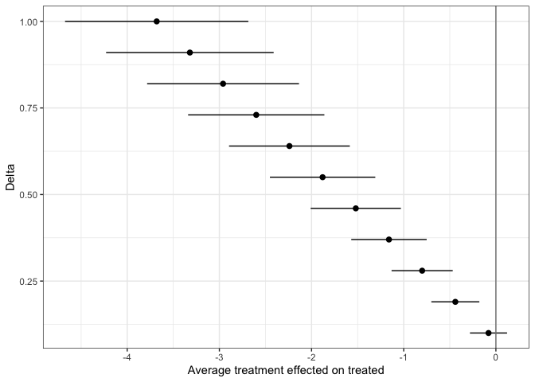

<!-- README.md is generated from README.Rmd. Please edit that file -->

# scqe

<!-- badges: start -->
<!-- badges: end -->

The scqe package allows users to implement the stability controlled
quasi-experiment (SCQE) (Hazlett, 2019) approach to study the effects of
newly adopted treatments that were not assigned at random. This package
contains tools to help users avoid making statistical assumptions that
rely on infeasible assumptions. The scqe function allows user to study
both the 1 cohort and 2 cohort cases.

## Motivation

Typical covariate-adjustment techniques used in statistical analysis
impose the often too strict “no-unobserved confounding” assumption.
Ignoring relevant confounding biases can lead to overconfidence or
inaccuracy of experimental results. SCQE instead imposes an assumption
about the “baseline trend” for the change in average non-treatment
outcome between successive cohorts in observational studies. More
information about this method can be found in Hazlett, 2019.

## Installation

You can install the development version of scqe from
[GitHub](https://github.com/) with:

``` r
# install.packages("devtools")
devtools::install_github("chadhazlett/scqe")
```

## Example

The following examples will demonstrate how to use the scqe function for
both the 1 and 2 cohort case when users wish to input either full data
or summary statistics alone.

Simulated data:

``` r
set.seed(1234)
post <- c(rep(0, 100), rep(1, 100))
tx <- c(rep(0, 100), rbinom(n = 100, prob = 0.27, size = 1))
y <- rbinom(n = 200, prob = 0.1 + 0.02 * post - 0.05 * tx, size = 1)
```

Example 1: 2 cohorts, full data

``` r
library(scqe)
scqe.2cohort.full <- scqe(post = post, treatment = tx, outcome = y, 
                          delta = seq(from = -0.1, to = 0.1, by = 0.05))
#> -- SCQE Method Result Table -- 
#> 
#>    term estimate   conf.low   conf.high        se
#> 1 -0.10     0.05 -0.3896977  0.48969765 0.2243397
#> 2 -0.05    -0.20 -0.6495160  0.24951598 0.2293491
#> 3  0.00    -0.45 -0.9297880  0.02978798 0.2447943
#> 4  0.05    -0.70 -1.2270007 -0.17299932 0.2688828
#> 5  0.10    -0.95 -1.5370811 -0.36291890 0.2995367
#> 
#> For more information, see full summary.
```

The results can be plotted by calling plot() on an scqe object.

``` r
plot(scqe.2cohort.full)
```


The results can be summarized by calling summary() on an scqe object.

``` r
summary(scqe.2cohort.full)
#> -- SCQE Method Results -- 
#> 
#> - Claims About Treatment Effects -
#>  1. To claim the treatment made the outcome significantly less likely:
#>     One must claim the shift in outcomes under no treatment change was 0.007 or above. 
#> 
#>  2. To claim the treatment made the outcome significantly more likely:
#>     One must claim the shift in outcomes under no treatment change was -0.184 or below. 
#> 
#>  3. To claim the treatment had 0 effect on the outcome:
#>     One must claim the shift in outcomes under no treatment change was exactly -0.09. 
#> 
#> 
#> - Full Results Table: - 
#>    term estimate   conf.low   conf.high        se
#> 1 -0.10     0.05 -0.3896977  0.48969765 0.2243397
#> 2 -0.05    -0.20 -0.6495160  0.24951598 0.2293491
#> 3  0.00    -0.45 -0.9297880  0.02978798 0.2447943
#> 4  0.05    -0.70 -1.2270007 -0.17299932 0.2688828
#> 5  0.10    -0.95 -1.5370811 -0.36291890 0.2995367
```

Example 2: 2 cohorts, summary statistics The user can input summary
statistics about the data instead of the full data (as in the previous
example). Plot and summary methods can be used here as well.

``` r
scqe.2cohort.sum <- scqe(untr_pre = 200, untr_post = 150, tr_post = 50, 
                         tr_pre = 0, Y_tr_post = 20, Y_untr_post = 1, 
                         Y_tr_pre = 0, Y_untr_pre = 5, min_delta = 0.1, 
                         max_delta = 1)
#> -- SCQE Method Result Table -- 
#> 
#>    term estimate   conf.low  conf.high        se
#> 1  1.00    -3.68 -4.6742149 -2.6857851 0.5072618
#> 2  0.91    -3.32 -4.2289147 -2.4110853 0.4637405
#> 3  0.82    -2.96 -3.7838928 -2.1361072 0.4203612
#> 4  0.73    -2.60 -3.3392450 -1.8607550 0.3771728
#> 5  0.64    -2.24 -2.8951166 -1.5848834 0.3342493
#> 6  0.55    -1.88 -2.4517369 -1.3082631 0.2917078
#> 7  0.46    -1.52 -2.0094884 -1.0305116 0.2497436
#> 8  0.37    -1.16 -1.5690543 -0.7509457 0.2087050
#> 9  0.28    -0.80 -1.1317569 -0.4682431 0.1692668
#> 10 0.19    -0.44 -0.7004044 -0.1795956 0.1328618
#> 11 0.10    -0.08 -0.2814172  0.1214172 0.1027658
#> 
#> For more information, see full summary.
plot(scqe.2cohort.sum)
```



``` r
summary(scqe.2cohort.sum)
#> -- SCQE Method Results -- 
#> 
#> - Claims About Treatment Effects -
#>  1. To claim the treatment made the outcome significantly less likely:
#>     One must claim the shift in outcomes under no treatment change was 0.136 or above. 
#> 
#>  2. To claim the treatment made the outcome significantly more likely:
#>     One must claim the shift in outcomes under no treatment change was 0.036 or below. 
#> 
#>  3. To claim the treatment had 0 effect on the outcome:
#>     One must claim the shift in outcomes under no treatment change was exactly 0.08. 
#> 
#> 
#> - Full Results Table: - 
#>    term estimate   conf.low  conf.high        se
#> 1  1.00    -3.68 -4.6742149 -2.6857851 0.5072618
#> 2  0.91    -3.32 -4.2289147 -2.4110853 0.4637405
#> 3  0.82    -2.96 -3.7838928 -2.1361072 0.4203612
#> 4  0.73    -2.60 -3.3392450 -1.8607550 0.3771728
#> 5  0.64    -2.24 -2.8951166 -1.5848834 0.3342493
#> 6  0.55    -1.88 -2.4517369 -1.3082631 0.2917078
#> 7  0.46    -1.52 -2.0094884 -1.0305116 0.2497436
#> 8  0.37    -1.16 -1.5690543 -0.7509457 0.2087050
#> 9  0.28    -0.80 -1.1317569 -0.4682431 0.1692668
#> 10 0.19    -0.44 -0.7004044 -0.1795956 0.1328618
#> 11 0.10    -0.08 -0.2814172  0.1214172 0.1027658
```

Example 3: 1 cohort, full data

``` r
scqe.1cohort.full <- scqe(treatment = tx, outcome = y, delta = seq(from = -0.1, 
                                                                   to = 0.1, 
                                                                   by = 0.05))
#> -- SCQE Method Result Table -- 
#> 
#>    term estimate   conf.low conf.high        se
#> 1 -0.10     2.15  1.1502243 3.1497757 0.5100990
#> 2 -0.05     1.65  0.8317969 2.4682031 0.4174582
#> 3  0.00     1.15  0.4971385 1.8028615 0.3330987
#> 4  0.05     0.65  0.1305125 1.1694875 0.2650495
#> 5  0.10     0.15 -0.2976311 0.5976311 0.2283874
#> 
#> For more information, see full summary.
plot(scqe.1cohort.full)
```


``` r
summary(scqe.1cohort.full)
#> -- SCQE Method Results -- 
#> 
#> - Claims About Treatment Effects -
#>  1. To claim the treatment made the outcome significantly less likely:
#>     One must claim the shift in outcomes under no treatment change was 0.164 or above. 
#> 
#>  2. To claim the treatment made the outcome significantly more likely:
#>     One must claim the shift in outcomes under no treatment change was 0.066 or below. 
#> 
#>  3. To claim the treatment had 0 effect on the outcome:
#>     One must claim the shift in outcomes under no treatment change was exactly 0.115. 
#> 
#> 
#> - Full Results Table: - 
#>    term estimate   conf.low conf.high        se
#> 1 -0.10     2.15  1.1502243 3.1497757 0.5100990
#> 2 -0.05     1.65  0.8317969 2.4682031 0.4174582
#> 3  0.00     1.15  0.4971385 1.8028615 0.3330987
#> 4  0.05     0.65  0.1305125 1.1694875 0.2650495
#> 5  0.10     0.15 -0.2976311 0.5976311 0.2283874
```

Example 4: 1 cohort, summary statistics

``` r
scqe.1cohort.sum <- scqe(untr = 100, tr = 200, Y_untr = 5, Y_tr = 50, 
                         min_outcome = 0.1, max_outcome = 1, min_delta = 0.1, 
                         max_delta = 1)
#> -- SCQE Method Result Table -- 
#> 
#>    term estimate    conf.low   conf.high         se
#> 1  1.00   -1.225 -1.34318564 -1.10681436 0.06029991
#> 2  0.91   -1.090 -1.19936286 -0.98063714 0.05579840
#> 3  0.82   -0.955 -1.05592954 -0.85407046 0.05149561
#> 4  0.73   -0.820 -0.91299171 -0.72700829 0.04744562
#> 5  0.64   -0.685 -0.77068718 -0.59931282 0.04371875
#> 6  0.55   -0.550 -0.62919140 -0.47080860 0.04040452
#> 7  0.46   -0.415 -0.48871846 -0.34128154 0.03761215
#> 8  0.37   -0.280 -0.34951039 -0.21048961 0.03546514
#> 9  0.28   -0.145 -0.21180663 -0.07819337 0.03408564
#> 10 0.19   -0.010 -0.07579291  0.05579291 0.03356843
#> 11 0.10    0.125  0.05845349  0.19154651 0.03395292
#> 
#> For more information, see full summary.
plot(scqe.1cohort.sum)
```


``` r
summary(scqe.1cohort.sum)
#> -- SCQE Method Results -- 
#> 
#> - Claims About Treatment Effects -
#>  1. To claim the treatment made the outcome significantly less likely:
#>     One must claim the shift in outcomes under no treatment change was 0.227 or above. 
#> 
#>  2. To claim the treatment made the outcome significantly more likely:
#>     One must claim the shift in outcomes under no treatment change was 0.139 or below. 
#> 
#>  3. To claim the treatment had 0 effect on the outcome:
#>     One must claim the shift in outcomes under no treatment change was exactly 0.183. 
#> 
#> 
#> - Full Results Table: - 
#>    term estimate    conf.low   conf.high         se
#> 1  1.00   -1.225 -1.34318564 -1.10681436 0.06029991
#> 2  0.91   -1.090 -1.19936286 -0.98063714 0.05579840
#> 3  0.82   -0.955 -1.05592954 -0.85407046 0.05149561
#> 4  0.73   -0.820 -0.91299171 -0.72700829 0.04744562
#> 5  0.64   -0.685 -0.77068718 -0.59931282 0.04371875
#> 6  0.55   -0.550 -0.62919140 -0.47080860 0.04040452
#> 7  0.46   -0.415 -0.48871846 -0.34128154 0.03761215
#> 8  0.37   -0.280 -0.34951039 -0.21048961 0.03546514
#> 9  0.28   -0.145 -0.21180663 -0.07819337 0.03408564
#> 10 0.19   -0.010 -0.07579291  0.05579291 0.03356843
#> 11 0.10    0.125  0.05845349  0.19154651 0.03395292
```
